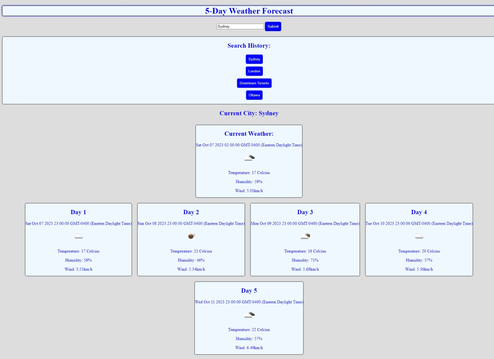
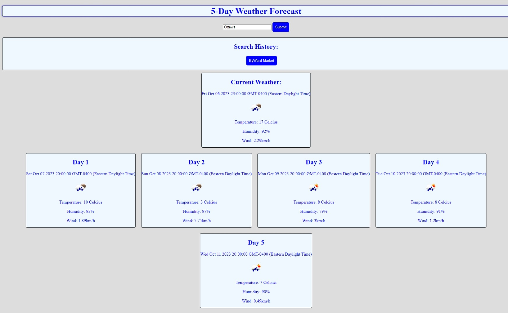

# week6-challenge

## Table of Contents

-[Description](#description)
-[Usage](#usage)
-[Visual](#visual)
-[URLs](#urls)

## Description

This is a simple weather forecast application. It can show the current weather in a city, as well as the forecast for the next five days in that city.

## Usage

The user only needs to enter the name of a city into the search bar, then click the submit button. After that, the information will be autonmatically populated.

## Visual

Fullscreen application:

Half screen application:

## URLs

Deployed webpage: https://shippo704.github.io/week6-challenge/

GitHub repository: https://github.com/Shippo704/week6-challenge
